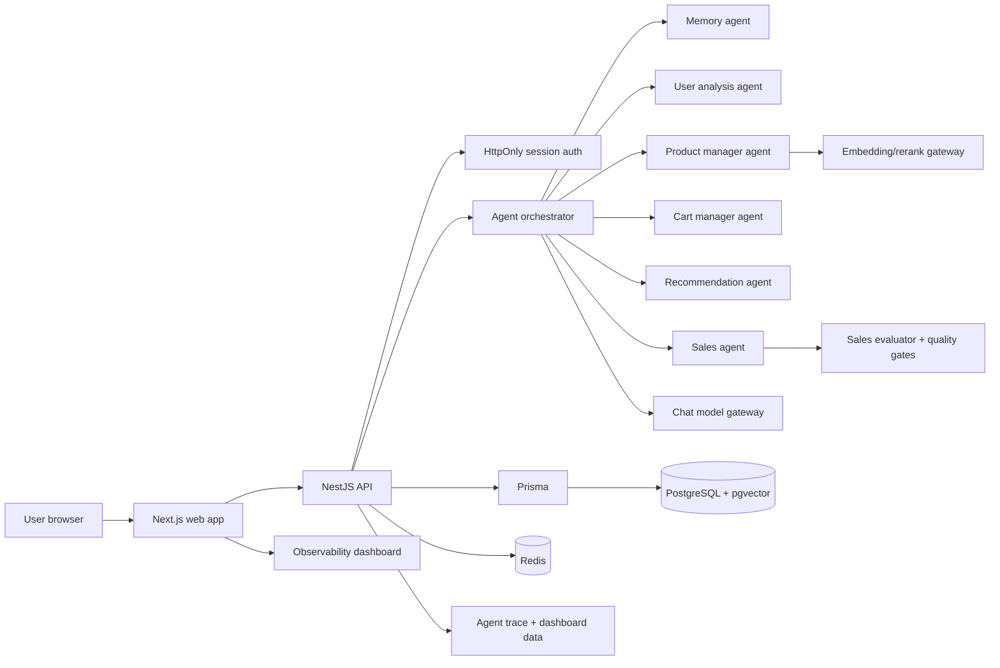

<div align="center">


# Retail AI Agent Provider Source

AI retail assistant source repo for local Hub installs: multi-agent chat, account cart, memory, observability, and reproducible Docker-backed runtime.


</div>

## Navigation

- [Overview](#overview)
- [Architecture](#architecture)
- [Requirements](#requirements)
- [Quick start](#quick-start)
- [Configuration](#configuration)
- [Lifecycle commands](#lifecycle-commands)
- [Real validation](#real-validation)
- [CI/CD](#cicd)
- [Repository map](#repository-map)
- [Docs](#docs)
- [Safety notes](#safety-notes)

## Overview

Retail AI Agent is a provider source repository that can be cloned by a Hub or another local project and started without manual patching. It includes:

| Area | What is included |
| --- | --- |
| Web app | Next.js storefront, chat widget, cart/account pages, agent dashboard |
| API | NestJS/Fastify backend with Prisma persistence |
| Agents | Memory, user analysis, product manager, cart manager, recommendation, sales, evaluator, quality gates |
| State | PostgreSQL with Prisma, Redis, account-bound cart, account-bound chat memory |
| Auth | HttpOnly cookie session flow with hashed sessions and explicit CORS |
| Runtime | Docker Compose for PostgreSQL/Redis, setup/stop/clean scripts for Linux/macOS and Windows |
| Validation | Unit/type/build checks in CI, runtime tests for real local validation |

This repo is intended to be installed from a fresh clone and validated with real retail workflows, not only health checks.

## Architecture



The response shown to the user is grounded by the recommendation handoff and final evaluator so product cards and assistant text should stay aligned.

## Requirements

| Tool | Version / note |
| --- | --- |
| Node.js | 20+ recommended; CI uses Node 22 |
| Corepack | Required for pnpm activation |
| pnpm | Managed by `packageManager`: `pnpm@10.20.0` |
| Docker | Required for local PostgreSQL/Redis unless `SKIP_DOCKER=1` |
| Docker Compose | Required for provider DB services |
| Real model gateway | Required for real chatbot validation |

## Quick start

### Linux/macOS/Git Bash

```bash
git clone https://github.com/baolnq-ai/agent-retail.git
cd agent-retail
cp .env.example .env
# Edit .env and set real CHAT_MODEL_BASE_URL, CHAT_MODEL_ID, and EMBED_RERANK_BASE_URL.
./setup.sh
```

### Windows PowerShell

```powershell
git clone https://github.com/baolnq-ai/agent-retail.git
Set-Location agent-retail
Copy-Item .env.example .env
# Edit .env and set real CHAT_MODEL_BASE_URL, CHAT_MODEL_ID, and EMBED_RERANK_BASE_URL.
.\setup.ps1
```

Default local URLs:

| Service | URL |
| --- | --- |
| Web | `http://127.0.0.1:7000` |
| API | `http://127.0.0.1:7010` |
| API health | `http://127.0.0.1:7010/health` |
| Products API | `http://127.0.0.1:7010/api/v1/products` |

## Configuration

`.env.example` is safe to publish and contains localhost placeholders only. For real mode, fill these values in `.env`:

| Key | Required | Purpose |
| --- | --- | --- |
| `CHAT_MODEL_BASE_URL` | Yes | Chat model gateway base URL |
| `CHAT_MODEL_ID` | Yes | Model identifier used by the sales/agent pipeline |
| `EMBED_RERANK_BASE_URL` | Yes | Embedding/rerank gateway URL |
| `API_PORT` | No | API host port, default `7010` |
| `WEB_PORT` | No | Web host port, default `7000` |
| `POSTGRES_PORT` | No | PostgreSQL host port, default `55432` |
| `REDIS_PORT` | No | Redis host port, default `56379` |
| `COMPOSE_PROJECT_NAME` | No | Provider-scoped Docker Compose project name |

Do not commit `.env`, API keys, cookies, session tokens, or logs containing secrets.

## Lifecycle commands

### Linux/macOS/Git Bash

```bash
./setup.sh   # install deps, start Docker services, prepare DB, build API, start API and web
./stop.sh    # stop provider-owned PID processes and provider Compose services
./clean.sh   # stop and delete provider-owned containers, volumes, networks, images, PIDs, and runtime locks
```

### Windows PowerShell

```powershell
.\setup.ps1
.\stop.ps1
.\clean.ps1
```

Cleanup is provider-scoped. It uses the configured Compose project and does not run global Docker prune commands.

## Real validation

A provider pass requires the real business workflow, not only `/health`.

Recommended local validation after `setup`:

1. Open `http://127.0.0.1:7000`.
2. Register or log in.
3. Ask: `tư vấn máy lọc dưới 2 triệu`.
4. Confirm the assistant answer and product rail refer to the same real catalog product.
5. Add a product to cart from chat or product UI.
6. Ask: `cho xem giỏ hàng` and confirm the account-bound cart is shown.
7. Remove or clear cart items and confirm the UI state changes.
8. Open the agent dashboard and confirm the pipeline/quality gate trace appears.
9. Inspect non-secret logs under `logs/` for `ERROR`, `FATAL`, fallback markers, missing env, or port bind failures.
10. Run `clean` and verify provider-owned containers, volumes, networks, images, PID files, and stale runtime locks are gone.

Runtime test commands:

```bash
corepack pnpm --filter @retail-agent/api test:runtime
corepack pnpm --filter @retail-agent/web test:runtime
```

These runtime tests require the app and real configured services to be running. Do not count a fallback response as a real pass.

## CI/CD

GitHub Actions workflow: `.github/workflows/ci.yml`.

The workflow runs on:

- `ubuntu-latest`
- `windows-latest`
- `macos-latest`

CI steps:

```bash
corepack pnpm install --frozen-lockfile
corepack pnpm typecheck
corepack pnpm --filter @retail-agent/api test
corepack pnpm build
```

Linux CI also validates Docker Compose config:

```bash
docker compose -f infra/docker/docker-compose.yml config --quiet
```

CI does not use real model secrets. Real model validation remains a local/provider acceptance step.

## Repository map

```text
apps/
  api/                  NestJS API, Prisma schema, agent services, runtime tests
  web/                  Next.js storefront, chat UI, dashboard
infra/
  docker/               Provider-scoped PostgreSQL/Redis Compose file
packages/
  shared/               Shared workspace package
docs/
  provider-source-hub-readiness-checklist.md
setup.sh                Linux/macOS/Git Bash install + run
stop.sh                 Linux/macOS/Git Bash scoped stop
clean.sh                Linux/macOS/Git Bash scoped delete/reset
setup.ps1               Windows setup + run
stop.ps1                Windows scoped stop
clean.ps1               Windows scoped delete/reset
```

## Docs

| Document | Purpose |
| --- | --- |
| [`docs/provider-source-hub-readiness-checklist.md`](docs/provider-source-hub-readiness-checklist.md) | Acceptance checklist for Hub provider source readiness |
| [`docs/architecture.md`](docs/architecture.md) | System architecture |
| [`docs/agent-pipeline.md`](docs/agent-pipeline.md) | Chatbot and agent pipeline |
| [`docs/operations.md`](docs/operations.md) | Local operations guidance |
| [`.github/workflows/ci.yml`](.github/workflows/ci.yml) | Multi-platform CI definition |

## Safety notes

- Health checks are not enough; validate a real retail workflow.
- The chatbot must not silently pass by fallback/mock data when real mode is required.
- Runtime model keys and private endpoints belong in `.env`, not in source.
- Scripts do not print `.env` contents or raw secrets.
- Stop/clean scripts are provider-scoped and must not kill unrelated local processes.
- Docker cleanup uses the provider Compose project and avoids global prune commands.
