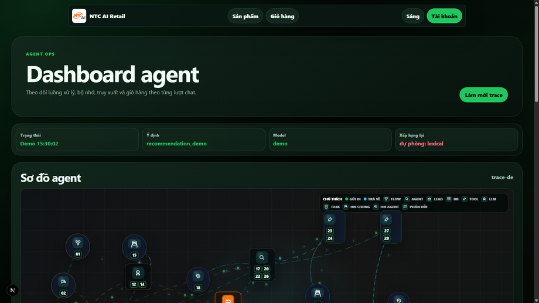
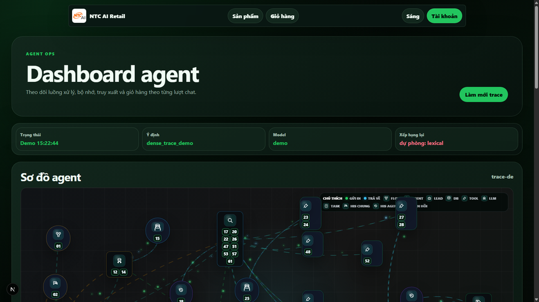
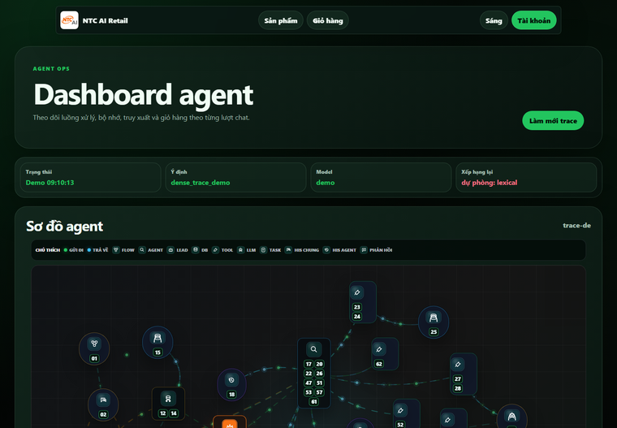
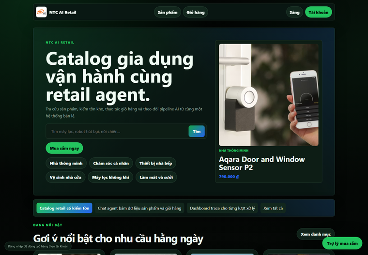
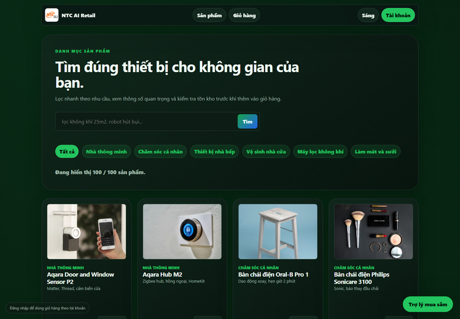
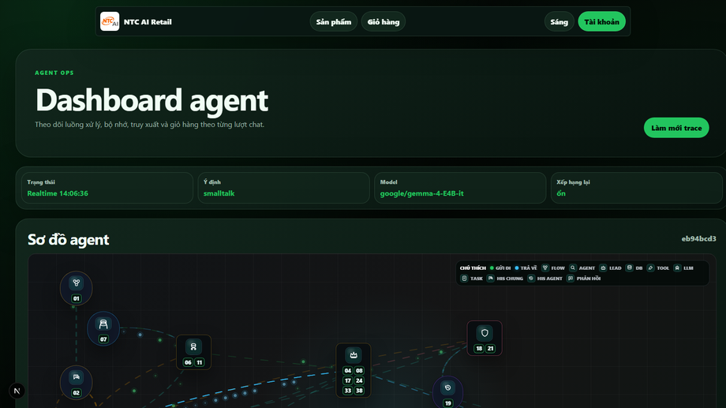
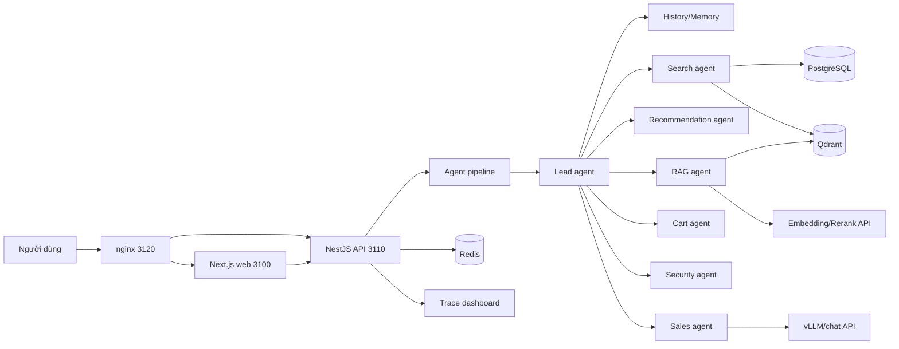

<div align="center">


# RetailHome AI Agent

Trợ lý bán hàng retail dùng pipeline nhiều agent, trace dashboard, Qdrant search và Docker Compose full stack.

[](https://github.com/baolnq-ai/agent-retail/actions/workflows/ci.yml)


<strong>
<a href="#chạy-nhanh-bằng-docker">Chạy nhanh</a>
 · <a href="#docker-hub--multi-arch">Docker Hub</a>
 · <a href="#port-mặc-định">Port</a>
 · <a href="#kiến-trúc">Kiến trúc</a>
 · <a href="#api-chính">API</a>
 · <a href="#test-và-benchmark">Test</a>
 · <a href="#tài-liệu-liên-quan">Tài liệu</a>
</strong>

</div>

<br />

<table>
  <tr>
    <td><strong>Cập nhật</strong></td>
    <td>2026-05-29</td>
    <td><strong>Docker image</strong></td>
    <td><code>v0.1.0-20260528</code></td>
  </tr>
  <tr>
    <td><strong>Docker Hub</strong></td>
    <td><code>baonguyen3568/ai-agent-retail</code></td>
    <td><strong>Runtime ports</strong></td>
    <td><code>3100-3150</code></td>
  </tr>
</table>

## AI Runtime Console

<table>
  <tr>
    <td width="64%">
      
    </td>
    <td width="36%">
      <h3>Agent Ops</h3>
      <p>Dashboard trace đọc trực tiếp flow sau mỗi lượt chat: task, memory, search, recommendation, RAG, cart, guardrail và phản hồi cuối.</p>
      <table>
        <tr><td><strong>Pipeline</strong></td><td><code>multi-agent</code></td></tr>
        <tr><td><strong>Vector</strong></td><td><code>Qdrant + embedding</code></td></tr>
        <tr><td><strong>Memory</strong></td><td><code>PostgreSQL</code></td></tr>
        <tr><td><strong>Entry</strong></td><td><code>nginx :3120</code></td></tr>
      </table>
    </td>
  </tr>
</table>

<table>
  <tr>
    <th>Agent graph</th>
    <th>Prompt studio</th>
    <th>Docker proof</th>
  </tr>
  <tr>
    <td></td>
    <td></td>
    <td></td>
  </tr>
  <tr>
    <td>Canvas gom agent, history riêng, tool riêng và flow trả về.</td>
    <td>Prompt lưu DB, chỉnh trực tiếp từ dashboard.</td>
    <td>Root Compose chạy web, API, DB, Redis, Qdrant, nginx.</td>
  </tr>
</table>

## Tổng Quan

Repo này là hệ thống retail chatbot có web storefront, chat widget, giỏ hàng theo tài khoản, backend API, bộ nhớ hội thoại, pipeline agent và dashboard quan sát flow. Trạng thái hiện tại ưu tiên ba cách vận hành rõ ràng: chạy full Docker bằng một compose file ở root, chạy source local bằng script, và tunnel toàn bộ qua một cổng nginx.

<table>
  <tr>
    <th>Frontend</th>
    <th>Backend</th>
    <th>Data & Search</th>
    <th>Runtime</th>
  </tr>
  <tr>
    <td>Next.js 16<br />React 19<br />Dashboard agent</td>
    <td>NestJS 11<br />Fastify<br />Prisma</td>
    <td>PostgreSQL + pgvector<br />Qdrant<br />Redis</td>
    <td>nginx tunnel<br />vLLM API<br />Embedding/Rerank API</td>
  </tr>
</table>

Search Agent dùng embedding API và Qdrant cho nhánh semantic khi exact/lexical search không đủ recall. PostgreSQL vẫn là nguồn fact chính cho giá, tồn kho, catalog, user, cart và memory; Redis cache catalog public để giảm độ trễ tải web.

## Giao Diện Và Evidence

<table>
  <tr>
    <th>Storefront</th>
    <th>Product grid</th>
  </tr>
  <tr>
    <td></td>
    <td></td>
  </tr>
  <tr>
    <td>Trang mua sắm, chat entry, brand assets và metadata production.</td>
    <td>Catalog thật, giá/tồn kho từ backend, dùng làm nguồn fact cho agent.</td>
  </tr>
</table>

<table>
  <tr>
    <th>Dashboard tabs</th>
    <th>Prompt DB</th>
  </tr>
  <tr>
    <td></td>
    <td></td>
  </tr>
  <tr>
    <td>Flow canvas và prompt editor tách tab, không dồn thông tin làm rối dashboard.</td>
    <td>Nhiều agent prompt được seed và đọc từ PostgreSQL qua API prompt settings.</td>
  </tr>
</table>

## Chạy Nhanh Bằng Docker

Đây là đường chạy gọn nhất sau khi pull repo. Cần Docker, `.env` tạo từ `.env.example`, và root `docker-compose.yml`.

<table>
  <tr>
    <th>1. Chuẩn bị env</th>
    <th>2. Pull image</th>
    <th>3. Chạy stack</th>
  </tr>
  <tr>
    <td><code>cp .env.example .env</code></td>
    <td><code>docker compose pull</code></td>
    <td><code>docker compose up -d</code></td>
  </tr>
</table>

```bash
cp .env.example .env
docker compose pull
docker compose up -d
```

Mở nhanh sau khi stack healthy:

<table>
  <tr>
    <th>Web/API qua nginx</th>
    <th>Dashboard agent</th>
    <th>API health</th>
  </tr>
  <tr>
    <td><code>http://127.0.0.1:3120</code></td>
    <td><code>http://127.0.0.1:3120/agent-dashboard</code></td>
    <td><code>http://127.0.0.1:3120/health</code></td>
  </tr>
</table>

Root `docker-compose.yml` là bản full Docker 100%, có đủ backend, frontend, PostgreSQL, Redis, Qdrant và nginx. File `infra/docker/docker-compose.yml` chỉ dùng cho chế độ dev source, nơi API/Web chạy từ source còn Docker chỉ chạy hạ tầng phụ trợ.

## Port Mặc Định

| Service | URL |
| --- | --- |
| Web trực tiếp | `http://127.0.0.1:3100` |
| API trực tiếp | `http://127.0.0.1:3110` |
| nginx/tunnel entry | `http://127.0.0.1:3120` |
| Dashboard agent | `http://127.0.0.1:3120/agent-dashboard` |
| API health | `http://127.0.0.1:3120/health` |
| PostgreSQL | `127.0.0.1:3132` |
| Redis | `127.0.0.1:3139` |
| Qdrant HTTP | `http://127.0.0.1:3133` |
| Qdrant gRPC | `127.0.0.1:3134` |

Toàn bộ port mặc định nằm trong dải `3100-3150`. Khi cần tunnel, trỏ tunnel vào `http://127.0.0.1:3120`.

## Chạy Bằng Setup Script

Windows PowerShell:

```powershell
Copy-Item .env.example .env
.\setup.ps1
```

Linux/macOS/Git Bash:

```bash
cp .env.example .env
./setup.sh
```

`setup.sh` có hai chế độ:

| Chế độ | Ý nghĩa |
| --- | --- |
| `source` | API/Web chạy từ source; `infra/docker/docker-compose.yml` chỉ chạy PostgreSQL, Redis, Qdrant, nginx dev |
| `docker` | Chạy 100% bằng root `docker-compose.yml`, gồm backend, frontend và hạ tầng |

Bỏ qua câu hỏi bằng env:

```bash
SETUP_RUN_MODE=docker ./setup.sh
SETUP_RUN_MODE=source ./setup.sh
```

Với `source`, script đọc `.env`, cài workspace bằng `pnpm`, chạy hạ tầng dev, generate/push/seed Prisma, build API, dọn process cũ trong dải port dự án, rồi chạy API và Web. Linux/macOS mặc định dùng tmux session `egnt-retail`:

Windows PowerShell cũng tự dọn runtime cũ trước khi start: `setup.ps1` load `.env`, gọi `stop.ps1`, dừng PID/process tree của API/Web thuộc repo, down các Compose project của repo (`retail_agent_provider`, `retail_agent_dev`, `retail_agent_full`), rồi mới start lại. Nếu Docker Desktop chưa sẵn sàng, setup sẽ fail sớm ở bước Docker Compose thay vì chờ DB timeout.

| Window | Nội dung |
| --- | --- |
| `egnt-retail:api` | NestJS API trên `3110` |
| `egnt-retail:web` | Next.js web trên `3100` |

## Docker Hub / Multi-Arch

Dự án dùng Docker Hub repository `baonguyen3568/ai-agent-retail`. `Dockerfile` ở root có hai target runtime `api` và `web`; cả hai image được publish cùng repository, tách bằng tag.

| Image tag | Vai trò | Kiến trúc |
| --- | --- | --- |
| `baonguyen3568/ai-agent-retail:api-v0.1.0-20260528` | Backend NestJS, Prisma, agent pipeline | `linux/amd64`, `linux/arm64` |
| `baonguyen3568/ai-agent-retail:web-v0.1.0-20260528` | Frontend Next.js | `linux/amd64`, `linux/arm64` |
| `baonguyen3568/ai-agent-retail:api-latest` | Latest backend | `linux/amd64`, `linux/arm64` |
| `baonguyen3568/ai-agent-retail:web-latest` | Latest frontend | `linux/amd64`, `linux/arm64` |

Build local trên kiến trúc hiện tại:

```bash
DOCKER_IMAGE_REPO=baonguyen3568/ai-agent-retail IMAGE_TAG=v0.1.0-20260528 sh scripts/docker-build-local.sh
docker compose up -d
```

Build và push multi-arch:

```bash
docker login
DOCKER_IMAGE_REPO=baonguyen3568/ai-agent-retail IMAGE_TAG=v0.1.0-20260528 sh scripts/docker-buildx-push.sh
```

Khi chạy qua tunnel/domain:

```env
TUNNEL_PUBLIC_URL=https://domain-cua-ban
NEXT_PUBLIC_SITE_URL=https://domain-cua-ban
NEXT_PUBLIC_API_BASE_URL=https://domain-cua-ban
CORS_ORIGINS=https://domain-cua-ban
NEXT_ALLOWED_DEV_ORIGINS=*.trycloudflare.com,domain-cua-ban
```

Với Cloudflare Quick Tunnel, trỏ tunnel vào nginx entry `http://127.0.0.1:3120`, đặt `TUNNEL_PUBLIC_URL` bằng URL `https://...trycloudflare.com`, rồi chạy lại `.\setup.ps1`. Setup sẽ truyền domain public cho Web/API để metadata, browser API base và CORS không còn giữ `127.0.0.1`.

Không commit `.env`, token hoặc credential Docker Hub.

## Dừng Và Xóa

```powershell
.\stop.ps1
.\clean.ps1
```

```bash
./stop.sh
./clean.sh
```

`stop` tắt API/Web và Compose project liên quan. `clean` xóa container, network, volume và image thuộc Compose project của repo. Script không chạy global Docker prune.

## Cấu Hình Chính

| Biến | Mặc định | Ý nghĩa |
| --- | --- | --- |
| `DOCKER_IMAGE_REPO` | `baonguyen3568/ai-agent-retail` | Repo image dùng bởi root compose |
| `IMAGE_TAG` | `v0.1.0-20260528` | Tag phát hành cho image API/Web |
| `PLATFORMS` | `linux/amd64,linux/arm64` | Kiến trúc buildx khi push multi-arch |
| `DOCKER_COMPOSE_PROJECT_NAME` | `retail_agent_full` | Project Compose full Docker |
| `COMPOSE_PROJECT_NAME` | `retail_agent_dev` | Project Compose dev infra |
| `CHAT_MODEL_BASE_URL` | placeholder trong `.env.example` | API vLLM/chat model |
| `CHAT_MODEL_ID` | `google/gemma-4-E4B-it` | Model chat mặc định |
| `EMBED_RERANK_BASE_URL` | placeholder trong `.env.example` | API embedding/rerank |
| `CORS_ORIGINS` | localhost ports | Origin browser được phép gọi API |
| `NEXT_PUBLIC_API_BASE_URL` | `http://127.0.0.1:3120` | API public cho browser |
| `NEXT_PUBLIC_SITE_URL` | `http://127.0.0.1:3120` | URL site cho metadata/share link |
| `NEXT_ALLOWED_DEV_ORIGINS` | `*.trycloudflare.com` | Origin dev server Next.js cho tunnel |
| `TUNNEL_PUBLIC_URL` | trống | URL public tunnel; khi có giá trị setup tự dùng cho `NEXT_PUBLIC_*` và CORS |
| `REDIS_URL` | `redis://localhost:3139` | Redis runtime cho cache catalog public |
| `CATALOG_CACHE_TTL_SECONDS` | `120` | TTL cache danh sách/chi tiết sản phẩm, tính bằng giây |
| `TMUX_SESSION` | `egnt-retail` | Session tmux runtime source |
| `RUN_DB_PUSH` | `1` | Container API tự chạy `prisma db push` khi start |
| `RUN_DB_SEED` | `1` | Container API tự seed dữ liệu khi start |

## Kiến Trúc



Flow chat: Web gửi `POST /api/v1/chat`, backend tạo trace, Lead agent điều phối agent cần thiết, agent gọi tool/DB/model, Sales agent viết câu trả lời cuối từ dữ liệu đã khóa, sau đó dashboard đọc trace để vẽ node/edge/playback.

## API Chính

Chat:

```http
POST /api/v1/chat
Content-Type: application/json

{ "message": "Tư vấn máy lọc không khí dưới 4 triệu" }
```

Response rút gọn:

```json
{
  "messageId": "uuid",
  "model": "google/gemma-4-E4B-it",
  "blocks": [{ "type": "text", "content": "..." }],
  "trace": {
    "traceId": "uuid",
    "intent": "recommend",
    "agents": ["lead-agent", "search-agent", "sales-agent"]
  }
}
```

Model gateway:

| Endpoint | Vai trò |
| --- | --- |
| `POST /model-gateway/chat` | Gọi chat/vLLM |
| `POST /model-gateway/embed` | Tạo embedding |
| `POST /model-gateway/rerank` | Rerank danh sách document |
| `GET /model-gateway/health` | Kiểm tra gateway |

Prompt settings:

| Endpoint | Vai trò |
| --- | --- |
| `GET /api/v1/prompt-settings` | Đọc prompt đang lưu trong PostgreSQL |
| `PUT /api/v1/prompt-settings` | Cập nhật prompt |
| `POST /api/v1/prompt-settings/reset` | Reset prompt về mặc định |

## Test Và Benchmark

Lệnh kiểm tra thường dùng:

```bash
corepack pnpm --filter @retail-agent/api typecheck
corepack pnpm --filter @retail-agent/web typecheck
corepack pnpm --filter @retail-agent/api build
corepack pnpm --filter @retail-agent/web build
docker compose --env-file .env.example -p retail_agent_full -f docker-compose.yml config --quiet
docker compose -f infra/docker/docker-compose.yml config --quiet
```

Evidence chính:

| Bộ test | Evidence |
| --- | --- |
| Docker full compose | [`tests/docker-full-compose-evidence-2026-05-28/README.md`](tests/docker-full-compose-evidence-2026-05-28/README.md) |
| Benchmark 100 câu | [`tests/benchmark-100/`](tests/benchmark-100/) |
| Hard flow 20 câu | [`tests/retail-chatbot-hard-flow-benchmark-evidence-2026-05-26/README.md`](tests/retail-chatbot-hard-flow-benchmark-evidence-2026-05-26/README.md) |
| Dashboard flow | [`tests/agent-dashboard-icon-legend-density-evidence-2026-05-26/README.md`](tests/agent-dashboard-icon-legend-density-evidence-2026-05-26/README.md) |

## Production Readiness

| Mảng | Hiện trạng | Cần làm trước production thật |
| --- | --- | --- |
| Docker runtime | Root compose chạy API, Web, PostgreSQL, Redis, Qdrant và nginx | Dùng registry/tag release cố định theo môi trường |
| Vector search | Search Agent query Qdrant bằng embedding thật khi cần semantic recall | Tách job ingest/index riêng, version collection, benchmark tải lớn |
| PostgreSQL | Prisma schema rõ, có bảng memory/cart/search/prompt | Dùng migration versioned thay cho `db push` khi deploy production |
| Security | HttpOnly cookie, CORS allowlist env, không đưa secret vào `.env.example` | Audit authz, rate limit, secret manager, TLS production |
| Observability | Có logs và dashboard trace | Thêm metrics, alerting, trace id xuyên suốt request |

## Repository Map

| Path | Nội dung |
| --- | --- |
| `apps/api/` | Backend NestJS, Prisma, services, controller, test API |
| `apps/web/` | Frontend Next.js, chat UI, cart/account, dashboard |
| `Dockerfile`, `docker-compose.yml` | Đóng gói API/Web và chạy toàn bộ project bằng một Compose file |
| `docker/` | Entrypoint container API và helper chờ service |
| `scripts/docker-build*.sh` | Build local và push multi-arch lên Docker Hub |
| `infra/docker/` | Compose/nginx phục vụ setup local dev source |
| `docs/` | Tài liệu kiến trúc, task, báo cáo |
| `plans/` | Plan theo phase và theo agent |
| `logs/` | Log triển khai, planning, testing |
| `tests/` | Test case, benchmark, evidence ảnh/report |
| `setup.*`, `stop.*`, `clean.*` | Script vận hành local |

## Tài Liệu Liên Quan

| Tài liệu | Nội dung |
| --- | --- |
| [`docs/README.md`](docs/README.md) | Index tài liệu |
| [`plans/CURRENT.md`](plans/CURRENT.md) | Plan đang chạy/vừa đóng |
| [`logs/CURRENT.md`](logs/CURRENT.md) | Log mới nhất |
| [`docs/task/docker-hub-multiarch-compose-20260528.md`](docs/task/docker-hub-multiarch-compose-20260528.md) | Task Docker Hub multi-arch |
| [`logs/implementation/docker-hub-multiarch-compose-20260528.md`](logs/implementation/docker-hub-multiarch-compose-20260528.md) | Log triển khai Docker |
| [`docs/reports/production-architecture-audit-20260526.md`](docs/reports/production-architecture-audit-20260526.md) | Audit kiến trúc production |

dev by ambrouse
