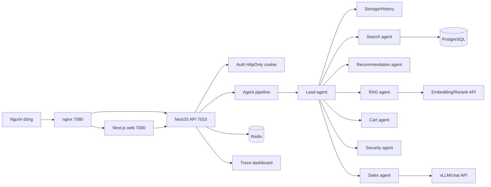

<div align="center">


# RetailHome AI Agent

Trợ lý bán hàng retail dùng Next.js, NestJS, PostgreSQL, Redis, pipeline nhiều agent, dashboard trace và nginx tunnel entry.


[Chạy nhanh](#chạy-nhanh) · [Port](#port-mặc-định) · [Kiến trúc](#kiến-trúc) · [API](#api-chính) · [Test](#test-và-benchmark) · [Docs](#tài-liệu-và-báo-cáo)

</div>

## Tổng Quan

Repo này là hệ thống retail chatbot có web storefront, chat widget, giỏ hàng theo tài khoản, backend API, bộ nhớ hội thoại, pipeline agent và dashboard quan sát flow. Mục tiêu hiện tại là chạy được local bằng script, có Docker Compose quản lý hạ tầng, và có một cổng nginx để tunnel dễ hơn.

| Phần | Công nghệ | Vai trò |
| --- | --- | --- |
| Frontend | Next.js 16, React 19 | Trang mua sắm, chat widget, tài khoản, giỏ hàng, dashboard agent |
| Backend | NestJS 11, Fastify, Prisma | API sản phẩm, auth, cart/order/payment mock, model gateway, agent pipeline |
| Database | PostgreSQL 16 + pgvector | Catalog, user, cart, memory, dữ liệu test |
| Cache | Redis 7 | Runtime cache/session phụ trợ |
| Proxy | nginx Docker | Một cổng vào cho tunnel: web + API cùng origin |
| Model | API ngoài | vLLM/chat model, embedding, rerank qua HTTP |

## Port Mặc Định

| Service | URL |
| --- | --- |
| Web trực tiếp | `http://127.0.0.1:7000` |
| API trực tiếp | `http://127.0.0.1:7010` |
| nginx/tunnel entry | `http://127.0.0.1:7080` |
| Dashboard agent | `http://127.0.0.1:7000/agent-dashboard` hoặc `http://127.0.0.1:7080/agent-dashboard` |
| API health | `http://127.0.0.1:7010/health` hoặc `http://127.0.0.1:7080/health` |
| PostgreSQL | `127.0.0.1:55432` |
| Redis | `127.0.0.1:56379` |

Khi cần tunnel, trỏ tunnel vào `http://127.0.0.1:7080`. nginx sẽ proxy:

| Path | Proxy đến |
| --- | --- |
| `/` | Next.js web |
| `/api/v1/*` | NestJS API |
| `/health` | NestJS health |
| `/model-gateway/*` | NestJS model gateway |

## Chạy Nhanh

Yêu cầu: Node.js 20+, Corepack, Docker Desktop hoặc Docker Engine.

### Windows PowerShell

```powershell
Copy-Item .env.example .env
.\setup.ps1
```

### Linux/macOS/Git Bash

```bash
cp .env.example .env
./setup.sh
```

Script sẽ:

1. đọc `.env`;
2. cài workspace bằng `pnpm`;
3. chạy Docker Compose cho PostgreSQL, Redis, nginx;
4. generate/push/seed Prisma;
5. build API;
6. chạy API và web;
7. in URL, port, log và lệnh stop.

## Dừng Và Xóa

```powershell
.\stop.ps1
.\clean.ps1
```

```bash
./stop.sh
./clean.sh
```

`stop` tắt API/web và `docker compose down`. `clean` xóa container, network, volume và image thuộc Compose project của repo. Script không chạy global Docker prune.

## Cấu Hình

File `.env.example` là cấu hình mẫu an toàn để copy sang `.env`.

| Biến | Mặc định | Ý nghĩa |
| --- | --- | --- |
| `API_PORT` | `7010` | Port backend NestJS |
| `WEB_PORT` | `7000` | Port frontend Next.js |
| `NGINX_PORT` | `7080` | Port nginx dùng để tunnel |
| `POSTGRES_PORT` | `55432` | Port PostgreSQL trên host |
| `REDIS_PORT` | `56379` | Port Redis trên host |
| `COMPOSE_PROJECT_NAME` | `retail_agent_provider` | Tên project Docker Compose |
| `DATABASE_URL` | localhost PostgreSQL | Prisma connection string |
| `REDIS_URL` | localhost Redis | Redis connection string |
| `CHAT_MODEL_BASE_URL` | `https://replace-with-your-vllm-gateway.example.invalid` | API vLLM/chat model |
| `CHAT_MODEL_ID` | `google/gemma-4-E4B-it` | Model chat dùng cho sales agent |
| `EMBED_RERANK_BASE_URL` | `https://replace-with-your-embed-rerank-gateway.example.invalid` | API embedding/rerank |

Không commit `.env`, token, cookie, private endpoint hoặc log có dữ liệu nhạy cảm.

## Kiến Trúc



Flow sau khi gửi một câu chat:

1. Web gửi `POST /api/v1/chat`.
2. Backend tạo trace, đọc session context và task context.
3. Lead agent điều phối các agent cần thiết.
4. Agent đọc/ghi task context, gọi tool/DB/model khi cần.
5. Kết quả quay về task context, sau đó về Lead.
6. Sales agent viết câu trả lời cuối từ dữ liệu đã khóa.
7. Lead trả `assistant-response` cho web.
8. Dashboard agent đọc trace để vẽ đúng node, edge, history riêng, tool riêng và flow trả về.

## API Chính

### Chat

```http
POST /api/v1/chat
Content-Type: application/json
Cookie: retail_session=...

{
  "message": "Tư vấn máy lọc không khí dưới 4 triệu"
}
```

Response rút gọn:

```json
{
  "messageId": "uuid",
  "model": "google/gemma-4-E4B-it",
  "blocks": [
    { "type": "text", "content": "..." },
    { "type": "product_list", "items": [] },
    { "type": "policy_answer", "items": [] },
    { "type": "cart_summary", "cart": {} }
  ],
  "trace": {
    "traceId": "uuid",
    "intent": "recommend",
    "agents": ["lead-agent", "search-agent", "sales-agent"],
    "nodes": [],
    "graphEdges": [],
    "playbackEvents": []
  }
}
```

### Stream Chat

```http
POST /api/v1/chat/stream
Content-Type: application/json

{ "message": "So sánh hai máy lọc không khí" }
```

Stream trả token và final payload để UI cập nhật chat theo thời gian thực.

### Model Gateway

Backend bọc model service ngoài qua `/model-gateway/*`.

Chat request:

```http
POST /model-gateway/chat
Content-Type: application/json

{
  "model": "google/gemma-4-E4B-it",
  "messages": [
    { "role": "system", "content": "Bạn là trợ lý bán hàng RetailHome." },
    { "role": "user", "content": "Tư vấn máy lọc không khí" }
  ],
  "temperature": 0.2,
  "maxTokens": 700
}
```

Chat response:

```json
{
  "content": "Nội dung trả lời của model",
  "usage": {
    "promptTokens": 1200,
    "completionTokens": 220,
    "totalTokens": 1420
  }
}
```

Embedding request:

```http
POST /model-gateway/embed
Content-Type: application/json

{ "input": ["máy lọc không khí phòng ngủ"] }
```

Embedding response:

```json
{
  "embeddings": [[0.01, -0.02, 0.03]],
  "dimensions": 768
}
```

Rerank request:

```http
POST /model-gateway/rerank
Content-Type: application/json

{
  "query": "máy lọc không khí phòng ngủ",
  "documents": [
    { "id": "doc-1", "text": "Máy lọc không khí..." }
  ],
  "topK": 3
}
```

Rerank response:

```json
{
  "results": [
    { "id": "doc-1", "score": 0.94, "index": 0 }
  ]
}
```

## Test Và Benchmark

Lệnh kiểm tra thường dùng:

```bash
corepack pnpm --filter @retail-agent/web typecheck
corepack pnpm --filter @retail-agent/web test
corepack pnpm --filter @retail-agent/api build
node --test apps/api/tests/agent-trace-contract.test.mjs apps/api/tests/pipeline-trace-bridge.test.mjs
node test/agent-pipeline/retail-chatbot-hard-flow-benchmark-20/runtime-chatbot-hard-flow-benchmark-20.mjs
```

Benchmark mới nhất:

| Bộ test | Kết quả | Evidence |
| --- | --- | --- |
| Hard flow 20 câu | 19 pass, 1 warn, 0 fail, `flowFail=0` | [`test/retail-chatbot-hard-flow-benchmark-evidence-2026-05-26/README.md`](test/retail-chatbot-hard-flow-benchmark-evidence-2026-05-26/README.md) |
| Dashboard legend/flow | 20 node, 48 edge, 0 overlap, 0 unresolved call | [`test/agent-dashboard-icon-legend-density-evidence-2026-05-26/README.md`](test/agent-dashboard-icon-legend-density-evidence-2026-05-26/README.md) |
| 30 câu chatbot | Report benchmark cũ | [`test/retail-chatbot-30q-benchmark-evidence-2026-05-25/README.md`](test/retail-chatbot-30q-benchmark-evidence-2026-05-25/README.md) |
| 100 câu chatbot | Report benchmark cũ | [`test/retail-chatbot-100q-agent-evidence-2026-05-25/README.md`](test/retail-chatbot-100q-agent-evidence-2026-05-25/README.md) |

## Repository Map

| Path | Nội dung |
| --- | --- |
| `apps/api/` | Backend NestJS, Prisma, services, controller, test API |
| `apps/web/` | Frontend Next.js, chat UI, cart/account, dashboard |
| `infra/docker/` | Docker Compose và nginx config |
| `docs/` | Tài liệu kiến trúc, task, báo cáo |
| `plans/` | Plan theo phase và theo agent |
| `logs/` | Log triển khai, planning, testing |
| `test/` | Test case, benchmark, evidence ảnh/report |
| `setup.*`, `stop.*`, `clean.*` | Script vận hành local |

## Tài Liệu Và Báo Cáo

| Tài liệu | Nội dung |
| --- | --- |
| [`docs/README.md`](docs/README.md) | Index tài liệu |
| [`docs/agent-pipeline/architecture/system-definition.md`](docs/agent-pipeline/architecture/system-definition.md) | Định nghĩa kiến trúc agent |
| [`docs/agent-pipeline/legacy/current-sales-pipeline.md`](docs/agent-pipeline/legacy/current-sales-pipeline.md) | Pipeline chatbot hiện tại |
| [`docs/task/agent-dashboard-cluster-flow-20260526-v1.md`](docs/task/agent-dashboard-cluster-flow-20260526-v1.md) | Dashboard flow và logic node/edge |
| [`docs/reports/chatbot-pipeline-audit-report.md`](docs/reports/chatbot-pipeline-audit-report.md) | Audit pipeline chatbot |
| [`plans/README.md`](plans/README.md) | Index plan |
| [`logs/README.md`](logs/README.md) | Index log |
| [`test/agent-pipeline/README.md`](test/agent-pipeline/README.md) | Index test agent pipeline |

## Ghi Chú Vận Hành

- Dùng `http://127.0.0.1:7080` làm entry khi cần tunnel.
- Nếu đổi port trong `.env`, chạy lại `setup`.
- Nếu web gọi API sai khi mở qua tunnel, kiểm tra `NEXT_PUBLIC_API_BASE_URL` trong log web; mặc định setup sẽ trỏ browser về nginx.
- Health check chỉ chứng minh server sống. Muốn pass thật phải chạy chat, xem product rail, thao tác cart và mở dashboard trace.
- Không push `.env`, dữ liệu thật, token, cookie hoặc log có secret.

dev by ambrouse
